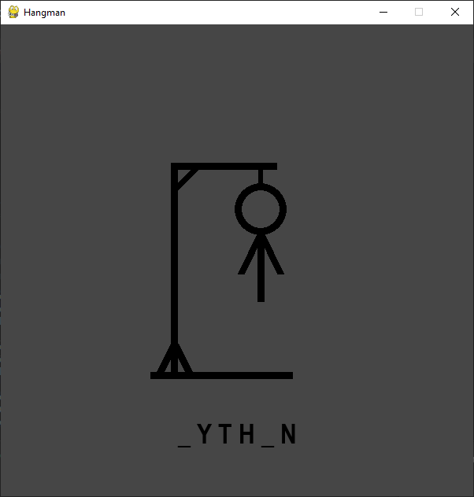

# Hangman
This game is made purely with the PyGame framework.  
It's also my very first project done in PyGame.



To run the game 

```
python -m pip install -r requirements.txt 
python hangman.py
```
  
or if you have python 2 installed too  
```
python3 -m pip install -r requirements.txt 
python3 hangman.py
```